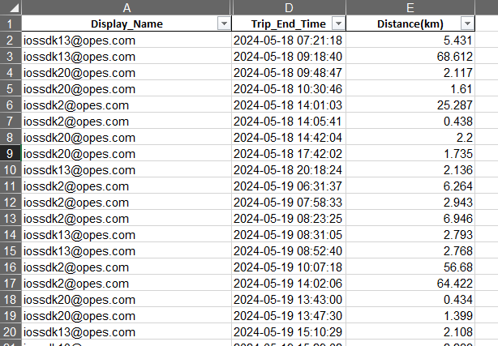

# **Đặt điều kiện giới hạn dữ liệu với `WHERE`**

OK, chúng ta đã đi qua phần cơ bản nhất của SQL là lấy dữ liệu từ nguồn sử dụng `SELECT` cùng `FROM`. Nhưng trong thực tế sử dụng, không có ai là sử dụng hết dữ liệu trong nguồn đó mà có một chút điều kiện lấy dữ liệu.

## **Ví dụ để hiểu hơn về `WHERE`**

Trước khi đi vào câu lệnh `WHERE`, chúng ta sẽ xem qua một ví dụ về filter trong file Excel.



File Excel mẫu này là một file chứa dữ liệu telematic của các tài khoản, giờ chúng ta sẽ sử dụng filter để lấy Display_name là tài khoản iossdk2@opes.com


Sau khi sử dụng filter, ta sẽ chỉ thấy các chuyến đi của user iossdk2@opes.com

## **Giải thích ngắn gọn về `WHERE`**
Vậy ví dụ này liên quan gì đến `WHERE`?

Thực chất lại liên quan mật thiết là đằng khác.

Nếu diễn tả lại phần filter này trong SQL, mọi thứ sẽ như sau:

```sql
SELECT
    DISPLAY_NAME,
    TRIP_END_TIME,
    DISTANCE
FROM SAMPLE_EXCEL
WHERE DISPLAY_NAME = 'iossdk2@opes.com'
```

Tương tự vậy, nếu chúng ta cần lấy các chuyến đi có distance lớn hơn hoặc bằng 35km chẳng hạn, nó sẽ như sau:

```sql
SELECT
    DISPLAY_NAME,
    TRIP_END_TIME,
    DISTANCE
FROM SAMPLE_EXCEL
WHERE DISTANCE >= 35
```
Như vậy, để nói về công dụng của `WHERE` thì `WHERE` như một filter vậy, chỉ cần ra điều kiện với từ khóa `WHERE` đằng trước là có thể lọc được dữ liệu mong muốn

## **Tổng kết**
- `WHERE` trong SQL hoạt động như một filter trong Excel
- `WHERE` + `điều kiện ` sẽ tạo thành một filer để lọc dữ liệu