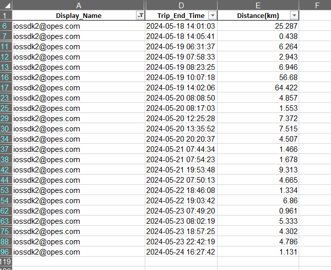
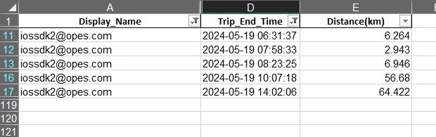

# **Tiếp tục lọc dữ liệu với `AND`, `OR` hoặc `NOT`**

Okay, chúng ta đã đi qua các kiểu dữ liệu cùng với `WHERE` để tạo filter dữ liệu. Nhưng thực tế thì đâu phải có một filter để lọc dữ liệu mình mong muốn.

## **`AND` để tạo thêm một lớp filter nữa**

Chúng ta sẽ tiếp tục nhìn lại ví dụ về filter trong Excel sau khi đã lọc các chuyến đi của user `iossdk2@opes.com`



Giả sử, giờ chúng ta muốn chỉ lấy các chuyến kết thúc trong ngày 19/05/2024 của user này, như một người dùng Excel thông thường, chúng ta sẽ filter tiếp ở trường Trip_End_Time và chọn ngày là 2024 -> May -> 19



Vậy nếu diễn giải ra SQL, chúng ta sẽ làm như thế nào ? Đó là lúc `AND` được sử dụng.

```sql
SELECT
    DISPLAY_NAME,
    TRIP_END_TIME,
    DISTANCE
FROM SAMPLE_EXCEL
WHERE DISPLAY_NAME = 'iossdk2@opes.com'
AND date_trunc('day',TRIP_END_TIME) = date '2024-05-19'
```

Trong lệnh này, do TRIP_END_TIME có kiểu dữ liệu là DATE, nhưng vì đặc thù của vế phải `date '2024-05-19` là tạo ra giá trị cho ngày 19/05/2024 nhưng về mặt giờ thì chỉ tính 0h0p0s, nên để lấy tất cả trong ngày thì về trái phải có thêm phần `date_trunc('day',TRIP_END_TIME)` để cắt phần giờ, phút, giây ra khỏi TRIP_END_TIME nhằm lấy thời gian chính xác nhất để lọc.

## **`OR` để lấy dữ liệu thỏa mãn một trong hai điều kiện**

Như từ khóa, `OR` là để lấy một tập dữ liệu với điều kiện này thỏa mãn hoặc điều kiện kia thỏa mãn.

Tiếp tục với ví dụ trước, nhưng giả sử chúng ta muốn lấy ngày 19/5 hoặc ngày 22/5, câu lệnh sẽ như sau:

```sql
SELECT
    DISPLAY_NAME,
    TRIP_END_TIME,
    DISTANCE
FROM SAMPLE_EXCEL
WHERE DISPLAY_NAME = 'iossdk2@opes.com'
AND 
(
    date_trunc('day',TRIP_END_TIME) = date '2024-05-19'
    OR date_trunc('day',TRIP_END_TIME) = date '2024-05-22'
)
```

Tuy nhiên, một lưu ý cho mọi người khi sử dụng `OR` chính là nên có thêm một cặp `(` và `)` để phân định rõ điều kiện cần lấy.

Tại sao lại cần một cặp ngoặc ? 

Hãy xem ví dụ sau:
```sql
SELECT
    DISPLAY_NAME,
    TRIP_END_TIME,
    DISTANCE
FROM SAMPLE_EXCEL
WHERE DISPLAY_NAME = 'iossdk2@opes.com'
AND date_trunc('day',TRIP_END_TIME) = date '2024-05-19'
OR date_trunc('day',TRIP_END_TIME) = date '2024-05-22'
```
Cũng giống lệnh ban nãy đúng không ?

Thực tế thì không giống chút nào. Tại sao ư ? Lệnh này sẽ được giải thích như sau: Lấy dữ liệu từ nguồn `SAMPLE_EXCEL` với ``tên hiển thị là iossdk2@opes.com và dữ liệu chuyến đi trong ngày 19/05`` hoặc `lấy tất cả dữ liệu với các chuyến đi vào ngày 22/05`.

Cho nên vì vậy, hãy dùng cặp `(` và `)` để phân biệt điều kiện trước khi chạy

## **`NOT` để lấy các giá trị không phải giá trị không mong muốn**

Chúng ta đã đi qua `AND` và `OR`, nhưng khi nào thì dùng `NOT`?

Cũng khá đơn giản, khi chúng ta không muốn nhìn giá trị đó xuất hiện trong tập dữ liệu chúng ta cần lấy.

Ví dụ đi, chúng ta có một file dữ liệu về thanh toán, dữ liệu trải dài từ đầu ngày đến cuối ngày. Nhưng khi so sánh với dữ liệu đơn hàng thì thấy đơn vào 15h lại quá nhiều, nên muốn dành một thời gian để kiểm tra riêng.

Theo logic người làm bình thường, thì chúng ta sẽ bật filter lên, và bỏ khung giờ 15h đi.

Lúc này, nếu diễn giải theo SQL thì nó cũng sẽ vậy. Ta sẽ coi dữ liệu thanh toán có tên là `PAYMENT` và có một trường là khung giờ có tên `HOUR_RECEIVE` để dễ hình dung

```sql
SELECT
    POL_NO,
    HOUR_RECEIVE,
    RECEIPT_AMOUNT,
    TRANSACTION_ID
FROM PAYMENT
WHERE HOUR_RECEIVE not '15'
```

Dễ hiểu đúng không ? Tuy nhiên chúng ta sẽ ít khi sử dụng `NOT` theo hình thức này, mà sẽ theo một hình thức khác và sẽ được nói trong phần sau.

## **Tổng kết**
- `AND`, `OR`, `NOT` sẽ được thêm vào sau điều kiện đầu tiên (điều kiện sau `WHERE`)

- `AND` để tiếp tục lọc dữ liệu theo một tiêu chí nào đó

- `OR` để lọc dữ liệu theo điều kiện này hoặc điều kiện kia

- `NOT` để bỏ một tập dữ liệu thuộc tiêu chí nào đó khỏi dữ liệu

- Nên có một cặp `(` và `)` để phân biệt điều kiện tránh lệnh bị hiểu sai