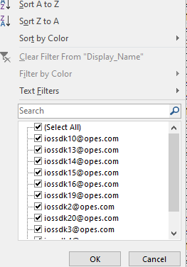

# **Sử dụng `DISTINCT` để lấy danh sách giá trị**

## **DISTINCT chính là filter trong Excel**

Đến được đây, chắc nhiều người sẽ hỏi 🤔: nhìn dữ liệu lớn như này, làm sao biết được các giá trị có trong đó như nào ? Như trong filter của Excel, tôi còn nhìn được dữ liệu của tôi cần lọc là gồm sản phẩm như này:



Well, SQL cũng có chứ! Và nó chính là `DISTINCT`.

Ví dụ này cũng sẽ tiếp tục với ví dụ Telematic trước đó, nhưng bối cảnh yêu cầu sẽ là: Lấy các giá trị display_name có trong file dữ liệu.

Nếu là người dùng Excel phổ thông, chỉ cần nhìn giá trị trong trường filter.

Vậy với người dùng SQL, nó sẽ là:

```sql
SELECT DISTINCT DISPLAY_NAME
FROM SAMPLE_EXCEL
```

## **Tổng kết**
- Như tên mục, `DISTINCT` chính là filter trong Excel